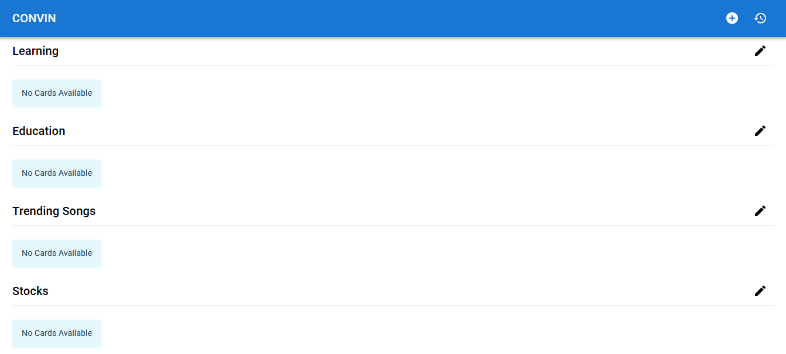
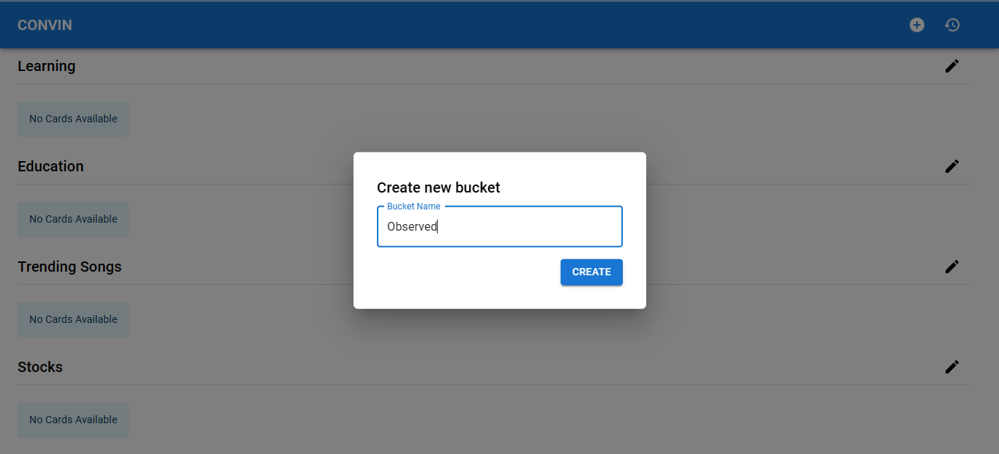
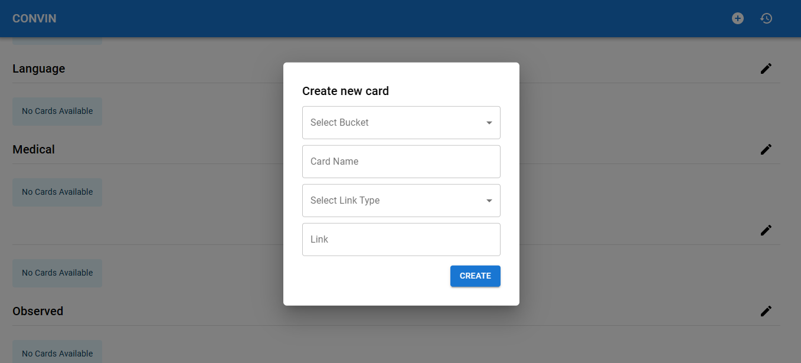
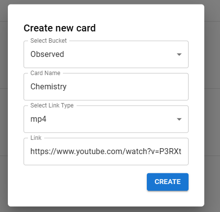
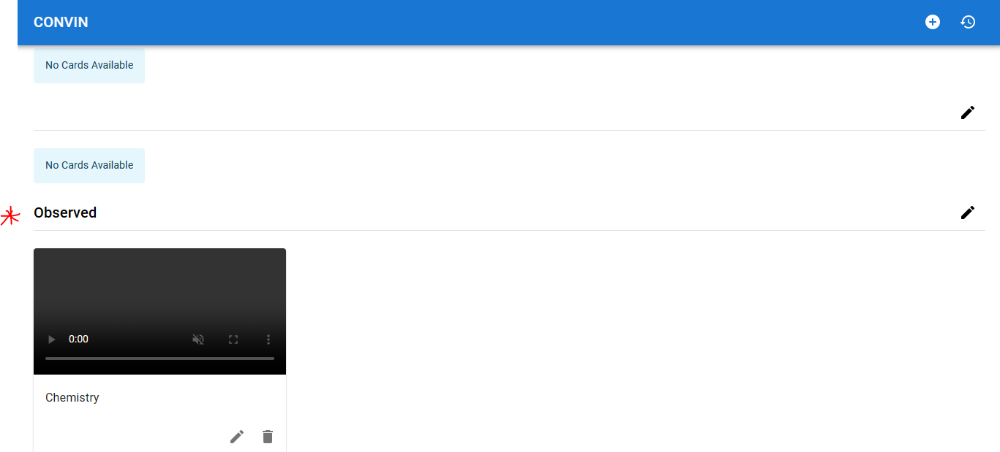
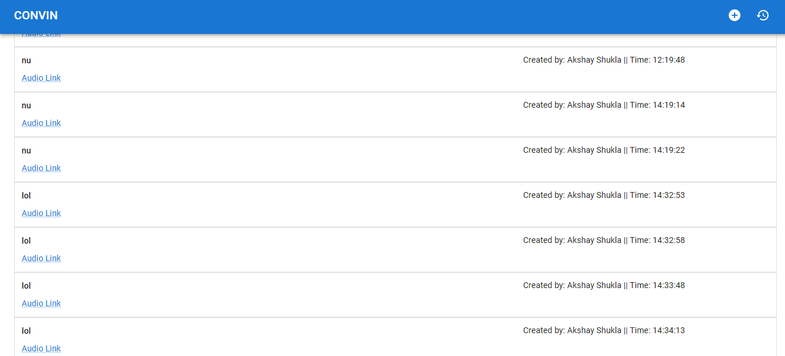

# Convin Web-App

This is a simple React application that allows users to create buckets and cards i.e. Entertainment Videos, Education Videos etc and cards(present inside the bucket) .

## Features

1. User can create, delete and edit a card
2. The card must contain name and a video/mp3 link
3. Each card can be created under a bucket (eg : Entertainment Videos, Education Videos, Etc )
4. The user has the flexibility to Name this bucket according to his/her choice.
5. User can move a card from one bucket to an other bucket.
6. On clicking on the card a modal with an iframe should open which starts playing the video
7. User can delete a single card or multiple card under a single bucket at once
8. There should be a separate tab called history which lists the mp3/mp4 links that you have
played i.e the card name, the link and the time it was played


## ScreenShots













## Live Link
For Live View Visit: https://convintaskwebapp.netlify.app/

## Run Locally

Clone the project

```bash
  git clone https://github.com/AkshayShukla16/Convin-Task-WebApp.git
```

Go to the project directory

```bash
  cd Convin-Task-WebApp
```

Install dependencies

```bash
  npm install
```

Start the server

```bash
  npm run dev
```

Open http://localhost:5173/ to view it in your browser.

